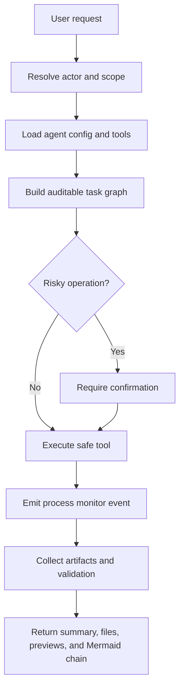

# Advanced AI Agent README Index

These READMEs describe the auditable operating chain for each advanced Giga AI Agent. They are not private chain-of-thought transcripts. They define visible checkpoints, required context, tools, outputs, and process-monitor events that users can inspect.

## Agents covered

- [Software Builder](software-builder.md)
- [Workflow Builder](workflow-builder.md)
- [Swarm Coordinator](swarm-coordinator.md)
- [Node Designer](node-designer.md)
- [Data Analyst](data-analyst.md)
- [Process Monitor Control](process-monitor-control.md)
- [Memory Agent](memory-agent.md)
- [Local Runner](local-runner.md)
- [Image/GIS Agent](image-gis-agent.md)
- [Platform Fix](platform-fix.md)
- [Deployment Agent](deployment-agent.md)

## Shared rules

1. Every advanced agent must produce observable evidence: tool inputs, selected scope, process id, artifacts, validation status, and user-visible summary.
2. Private model reasoning must not be emitted. User-visible decision chains use Mermaid and structured checkpoints.
3. Risky operations require confirmation and must be traceable through Process Monitor.
4. Generated project files must be written to the User Drive or Organisation Drive and must include source context docs.
5. The Software Builder must load the exported UI Kit markdown context before creating or modifying UI.

